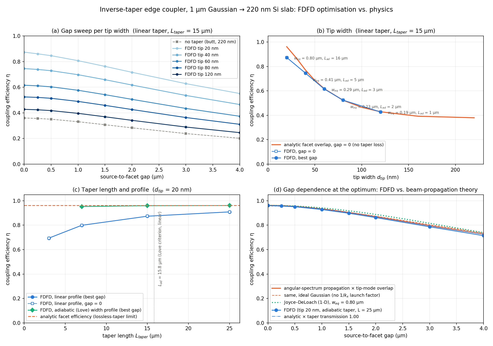
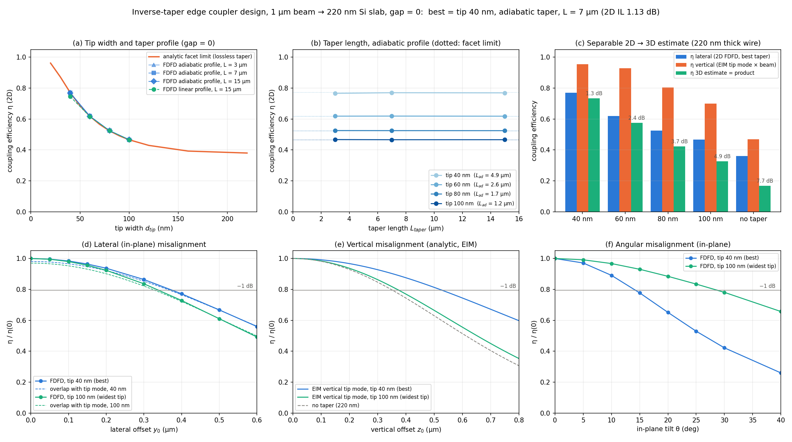

# Edge-coupler modelling and optimisation with 2D FDFD

Two-dimensional finite-difference frequency-domain (FDFD) model of light coupling from a
Gaussian beam (fibre) into a silicon slab waveguide at λ = 1550 nm, and its use to optimise an
**inverse-taper edge coupler** for a fixed platform (220 nm Si / SiO₂) and a fixed source (1 µm
Gaussian waist). The full write-up, with the theory, validation and the physical-plausibility
review, is in [`docs/edge_coupler_report.pdf`](docs/edge_coupler_report.pdf).


## Background

Photonic integrated circuits are manufactured in standard semiconductor foundries, but the
interface between the chip and an external single-mode fibre remains a bottleneck: the silicon
waveguide mode is sub-micron (≈ 450 × 220 nm) while a fibre mode is 2–10 µm, and the overlap of the
two is small. Edge couplers bridge the mismatch with an *inverse taper*: the waveguide narrows to
a sub-wavelength tip at the facet, the mode of the tip is weakly confined and therefore large,
and the taper transforms it adiabatically into the mode of the bulk waveguide. The insertion loss
depends on the tip width, the taper length and shape, the source position and the alignment —
this repository lets each of them be varied independently.

## What is in the repository

| file | purpose |
|---|---|
| `fdfd_waveguide.py` | the model: grid, PML, sparse Helmholtz operator (vectorised 5-point stencil, sub-pixel ε averaging), soft Gaussian source, slab-mode solver, power budget / insertion-loss analysis, plots. `python fdfd_waveguide.py` runs the default case; `simulate(params)` is the API used by the studies (the LU factorisation is cached and reused when only the source changes). |
| `fdfd_taper_study.py` | inverse-taper study: tip width × source-to-facet gap, taper length × gap, linear vs adiabatic width profile; analytic cross-checks (tip modes, exact beam propagation across the gap, Joyce–DeLoach formula, Love adiabaticity length). `--replot` regenerates the figure from the saved JSON. |
| `fdfd_coupler_design.py` | final design at zero gap with fabricable tips (40–100 nm): profile and length, alignment tolerance (lateral offset, in-plane tilt) by FDFD, and an effective-index 2D → 3D estimate with the vertical tolerance. `--replot` supported. |
| `fdfd_coupler_study.py` | reference sweeps of the *source* parameters on the untapered waveguide (waist, offset, tilt, slab thickness). |
| `docs/build_report.py` | assembles the PDF report from the text and the numbers/figures in `results/`. |
| `results/` | figures, JSON data and logs of the runs reported below. |


## Model

* Scalar Helmholtz equation for TE (E_z) on a uniform grid (Δx = 20 nm, Δy = 10–20 nm), solved directly
  with a sparse LU (SuperLU). Stretched-coordinate PML, cubic grading, σ_max = 10⁵ S/m (stretch ≈ 9).
* Soft (current-sheet) Gaussian source on one grid column; tilt via the transverse phase
  exp(−j k₀ n sinθ y). The source radiates both ways; the input power is the +x Poynting flux three
  cells downstream, S_x = −Im(E_z* ∂_x E_z)/(2ωμ₀) in the exp(+jωt) convention of the PML.
* Output: overlap of the field with the analytical TE₀ mode of the bulk slab, P_mode = |a|² β/(2ωμ₀),
  using the grid-consistent flux factor sin(βΔx)/Δx; η = P_mode/P_in, IL = −10 log₁₀ η.
* Built-in diagnostics: PML stretch check, standing-wave ratio |B|/|F| of the guided mode (reflections),
  n_eff of the discrete mode from the phase slope, total forward flux at the output, analytic overlap
  and soft-source (1/β-weighted) estimate.
* Geometry: uniform waveguide or facet + inverse taper with a linear or an *adiabatic* width law
  (derived from the Love delineation criterion), continuous widths through fill-fraction averaging.


## Validation (220 nm slab, 1 µm beam)

* Butt coupling at the facet: η = 0.360 (4.44 dB) vs the analytical overlap 0.368 × Fresnel-type factor
  4β_inβ_m/(β_in+β_m)² = 0.89.
* Gap dependence follows exact angular-spectrum beam propagation within 2 % (Rayleigh range 2.9 µm);
  no nonzero optimum gap exists for a flat-phase source.
* Clean travelling mode at the output (|B|/|F| ≈ 10⁻³); halving Δx changes η by 0.6 %.
* A 500 nm slab is three-mode at 1550 nm (TE₀, TE₁, TE₂); the TE₀–TE₂ beat (0.85 µm period) is the
  row of dots seen along the core in earlier results — the 220 nm platform is single-mode (V = 1.41).

## Results

### Inverse taper: tip width, gap, length, profile (`fdfd_taper_study.py`)

| tip | η, gap 0, linear 15 µm | analytic facet limit | L_ad (Love) |
|---|---|---|---|
| 20 nm | 0.874 | 0.962 | 15.8 µm |
| 40 nm | 0.746 | 0.771 | 4.9 µm |
| 60 nm | 0.616 | 0.618 | 2.6 µm |
| 80 nm | 0.525 | 0.524 | 1.7 µm |
| 120 nm | 0.428 | 0.429 | 0.8 µm |
| none | 0.360 | 0.368 × 0.89 | — |

For the 20 nm tip a linear taper reaches 0.909 at 25 µm, while the Love-profile taper reaches 0.953 at
7 µm and 0.961 at 25 µm — the facet limit — because a linear ramp is ~10× too steep at the tip
(Δβ ∝ d²). The gap optimum is zero for every geometry.



### Design at zero gap with fabricable tips (`fdfd_coupler_design.py`)

Gap fixed at zero (it cannot help), tips 40–100 nm, linear vs adiabatic profile, lengths 3–15 µm:

| tip | best profile | L | η 2D | IL 2D | η vertical (EIM) | η 3D estimate | IL 3D estimate |
|---|---|---|---|---|---|---|---|
| **40 nm** | **adiabatic** | **7 µm** | **0.770** | **1.13 dB** | 0.954 | 0.735 | **1.34 dB** |
| 60 nm | adiabatic | 7 µm | 0.619 | 2.08 dB | 0.928 | 0.575 | 2.41 dB |
| 80 nm | adiabatic | 3 µm | 0.525 | 2.80 dB | 0.804 | 0.422 | 3.74 dB |
| 100 nm | adiabatic | 3 µm | 0.467 | 3.31 dB | 0.700 | 0.327 | 4.86 dB |
| none | — | — | 0.360 | 4.44 dB | 0.468 | 0.169 | 7.73 dB |

Every tip reaches its analytic facet limit with the adiabatic profile already at 3–7 µm (the linear
15 µm taper is 1–3 % lower at 40–60 nm). The best design — **40 nm tip, adiabatic taper, 7 µm** —
recovers 3.3 dB of the 4.4 dB butt-coupling loss in 2D. The vertical overlap peaks near 40–50 nm
(0.95–0.97): a thinner tip makes the effective-index vertical mode *larger* than the 1 µm beam
(3.6 µm at 20 nm), so in 3D there is a genuine optimum tip width for a given spot.

Alignment tolerance (1 dB excess loss): best design — lateral 0.38 µm, vertical (EIM) 0.53 µm, in-plane
tilt 14°; 100 nm tip — 0.34 µm, 0.38 µm, 29°; bare wire — 0.33 µm / 33°. Position tolerance grows and
angular tolerance shrinks with the mode size, as expected from the Fourier relation between them.

The 2D → 3D column multiplies the in-plane FDFD efficiency by the vertical overlap of the beam with the
effective-index vertical mode of the tip (lateral tip index → core index of a 220 nm vertical slab). It
neglects substrate leakage, polarisation and the breakdown of the effective-index method near cut-off,
so it is an optimistic estimate; measured 3D couplers with comparable spots lie at 0.5–1.5 dB per facet.



## Reproducing

```bash
python fdfd_waveguide.py            # default case, results/fdfd_waveguide.png
python fdfd_taper_study.py          # ~10 min, results/fdfd_taper_study.{png,json}
python fdfd_coupler_design.py       # ~10 min, results/fdfd_coupler_design.{png,json}
python docs/build_report.py         # docs/edge_coupler_report.pdf
```

## References

[1] Ranno et al., ACS Photonics 9, 3467 (2022). 
[2] Corning SMF-28 Ultra datasheet. 
[3] Son et al., Nanophotonics 7, 1845 (2018). 
[4] Marchetti et al., Photonics Research 7, 201 (2019). 
[5–6, 9] Okamoto, Fundamentals of Optical Waveguides (2021). 
[7] Rumpf, PIER B 36, 221 (2012). 
[8] Jackson, Classical Electrodynamics. 
[10] Berenger, J. Comput. Phys. 114, 185 (1994). 
[11] Chrostowski & Hochberg, Silicon Photonics Design (2015). 
[12] Love et al., IEE Proc. J 138, 343 (1991). 
[13] Joyce & DeLoach, Appl. Opt. 23, 4187 (1984).


